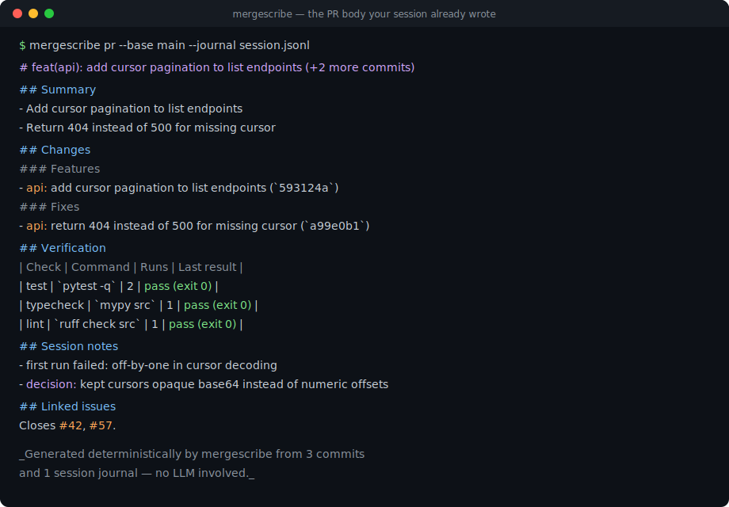
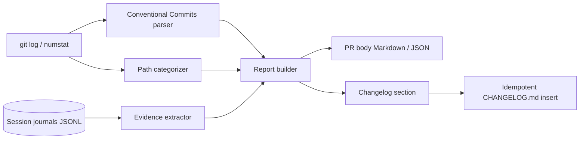

# mergescribe

[English](README.md) | [中文](README.zh.md) | [日本語](README.ja.md)

[](LICENSE) [](CHANGELOG.md) [](pyproject.toml)  [](CONTRIBUTING.md)

**セッションジャーナルと git 履歴から PR 説明文と changelog を決定的に生成するオープンソースツール — LLM 不使用、同じ入力なら同じバイト列。**



```bash
git clone https://github.com/JaydenCJ/mergescribe && cd mergescribe && pip install -e .
```

> **プレリリース：** mergescribe はまだ PyPI に公開されていません。初回リリースまでは [JaydenCJ/mergescribe](https://github.com/JaydenCJ/mergescribe) をクローンし、リポジトリ直下で `pip install -e .` を実行してください。ランタイム依存ゼロなので、`PYTHONPATH=src python3 -m mergescribe` ならインストールなしでも動きます。

## なぜ mergescribe？

いまやエージェントは人間が PR 本文を書くより速くコードを生み出し、流行りの解決策は diff にもう一つ LLM を向けて要約させること——トークンを消費し、diff を外部 API へ送り、しかもコミットに存在しない変更を自信満々に語ることさえあります。mergescribe は逆に賭けます：良い PR 説明文に必要なものはすべて既に*記録*として存在する——Conventional Commits、numstat、そしてどのテストが実際に走りどう終了したかを刻んだセッションジャーナル。だから生成せず抽出する：パースし、静的テーブルで分類し、レンダリングする。出力の一行一行が入力まで遡れ、実行のたびにバイト単位で一致し、欠落にも正直です（テスト計画をでっち上げず「ジャーナル未提供」と書く）。レビュー疲れのチームにとって、*幻覚が起こり得ない*説明文は、美文よりずっと価値があります。

|  | mergescribe | PR-Agent | Copilot PR 要約 | git-cliff | conventional-changelog |
|---|---|---|---|---|---|
| LLM / API キーが必要 | 不要 | 必要 | 必要（ホスト型） | 不要 | 不要 |
| 決定的（同じ入力 → 同じバイト列） | はい | いいえ | いいえ | はい | はい |
| changelog だけでなく PR 説明文も | はい | はい | はい | いいえ | いいえ |
| 実際の終了コードによる検証テーブル | はい（セッションジャーナル） | いいえ | いいえ | いいえ | いいえ |
| 出力が diff を幻覚しうる | 設計上不可能 | あり得る | あり得る | 該当なし | 該当なし |
| ランタイム依存 | 0 | 20+ | SaaS | Rust バイナリ | 300+ npm ツリー |

<sub>依存数は 2026-07 時点：pr-agent 0.3.x は PyPI 上で 20+ のランタイム依存を宣言し、conventional-changelog-cli は 300+ の npm パッケージを引き込みます。mergescribe は [pyproject.toml](pyproject.toml) の `dependencies = []` が答えです。</sub>

## 特徴

- **構造的に幻覚ゼロ** — 出力のすべての行はコミット・numstat 行・ジャーナルイベントのいずれかから解析されたもの。変更やテスト結果を発明しうる生成ステップは存在しません。
- **雰囲気ではなく証拠で検証** — ジャーナル内のコマンドを静的プレフィックス表で分類（test/typecheck/lint/format/build）し、正規化コマンド単位で重複排除、**最後の**終了コードを報告——PR が実際に出荷される状態であり、失敗は目立つ `FAIL` 行になります。
- **寛容な Conventional Commits パーサ** — scope・`!`・フッタブロック・`BREAKING CHANGE` 注記を完全サポートし、クローズ参照と単なる言及を区別。手書きの件名も捨てられず、正直な「その他の変更」欄に降格するだけです。
- **裏付けつき changelog** — コミット種別は文書化された対応表で Keep-a-Changelog 分類へ写像され、破壊的変更とセキュリティ変更は決してフィルタされず、`--insert` は CHANGELOG.md へ冪等に継ぎ足します（二度実行してもファイルは変わりません）。
- **時計も読まずネットワークにも触れない** — リリース日はコミット履歴か明示フラグから取得。起動する外部プロセスはローカルの `git` だけ。同じリポジトリとジャーナルなら二台のマシンで同一バイト列が得られます。
- **スクリプトに優しい** — `pr`・`commits`・`journal` は安定スキーマの `--format json` を話し、終了コードもきれい（0/1/2）。`gh pr create --title "$(...)"` のワンライナー向けに `--title-only` モードも備えます。

## クイックスタート

インストール（またはチェックアウトで `PYTHONPATH=src` を設定するだけ）：

```bash
git clone https://github.com/JaydenCJ/mergescribe && cd mergescribe && pip install -e .
```

同梱のデモリポジトリを構築し（日付固定なので出力はこの README と完全一致）、その feature ブランチとサンプルジャーナルから PR 本文を生成します：

```bash
bash examples/build_demo_repo.sh /tmp/demo
mergescribe -C /tmp/demo pr --base main --head feature --journal examples/session-journal.jsonl
```

実際に取得した出力（`...` で省略）：

```text
# feat(api): add cursor pagination to list endpoints (+2 more commits)

## Summary

- Add cursor pagination to list endpoints
- Return 404 instead of 500 for missing cursor
...
## Verification

| Check | Command | Runs | Last result |
|---|---|---|---|
| test | `pytest -q` | 2 | pass (exit 0) |
| typecheck | `mypy src` | 1 | pass (exit 0) |
| lint | `ruff check src` | 1 | pass (exit 0) |

## Session notes

- first run failed: off-by-one in cursor decoding
- decision: kept cursors opaque base64 instead of numeric offsets
...
Closes #42, #57.

_Generated deterministically by mergescribe from 3 commits and 1 session journal — no LLM involved._
```

同じ範囲の changelog セクション。日付は最新コミットから取り、今日の時計は決して使いません：

```bash
mergescribe -C /tmp/demo changelog --base main --head feature --release 0.2.0
```

```text
## [0.2.0] - 2026-07-11

### Added

- **api:** Add cursor pagination to list endpoints (#42)

### Fixed

- **api:** Return 404 instead of 500 for missing cursor (#57)
```

## セッションジャーナル

ジャーナルは JSONL ファイル（1 行 1 イベント）で、エージェントハーネス・シェルフック・人間の手いずれでも書けます。mergescribe は緩いキー別名を受け付けるため、多くのハーネスのログはそのまま読めます。完全な仕様は [`docs/journal-format.md`](docs/journal-format.md) を参照。

| イベント種別 | 別名 | 供給先 |
|---|---|---|
| `command` | `cmd`・`run`・`shell`・`exec`・`tool` | 検証テーブル（終了コード付き） |
| `note` / `decision` | `comment`・`observation`・`log`・`choice` | セッションノート |
| `edit` | `write`・`patch`・`file_edit` | 予約（diff 突合、ロードマップ参照） |

同じコマンドの再実行は 1 行に畳まれます：`runs` が回数を数え、**最後の**終了コードが勝つ——最初赤くて直したテストは `pass (exit 0)` に、セッション終了時まで失敗していたチェックは表の中で堂々と `FAIL` になります。

## コミットはどこに落ちるか

| コミット種別 | PR セクション | changelog 分類（デフォルト） |
|---|---|---|
| `feat` | Features | Added |
| `fix` | Fixes | Fixed（scope/CVE が示せば Security） |
| `perf`・`refactor`・`revert` | Performance / Refactoring / Reverts | Changed |
| `docs`・`test`・`build`・`ci`・`chore`・`style` | 各自のセクション | 既定で除外（`--all` で含める） |
| 破壊的変更すべて（`!` または `BREAKING CHANGE`） | Breaking changes セクション | 常に含める |
| 非規約の件名 | Other changes | 既定で除外（`--all` で含める） |

## アーキテクチャ



## ロードマップ

- [x] コミット/ジャーナル抽出、PR 本文 + changelog レンダリング、4 サブコマンド、JSON 出力、冪等挿入（v0.1.0）
- [ ] `edit` イベント突合：diff では変わったのにジャーナルで触れていないファイル（およびその逆）を警告
- [ ] 主要エージェントハーネスの transcript 形式をネイティブ対応
- [ ] PyPI 公開（`pip install mergescribe`）
- [ ] `mergescribe pr --update`：マーカーブロック経由で既存 PR 本文をその場で更新

全リストは [open issues](https://github.com/JaydenCJ/mergescribe/issues) を参照。

## コントリビュート

コントリビュート歓迎です — [good first issue](https://github.com/JaydenCJ/mergescribe/issues?q=is%3Aissue+is%3Aopen+label%3A%22good+first+issue%22) から始めるか、[discussion](https://github.com/JaydenCJ/mergescribe/discussions) を立ててください。開発環境は [CONTRIBUTING.md](CONTRIBUTING.md) を参照。本リポジトリは CI を持ちません — ローカルで走らせる `pytest`（91 テスト）と `bash scripts/smoke.sh`（`SMOKE OK` を印字すること）が検証のすべてです。

## ライセンス

[MIT](LICENSE)
