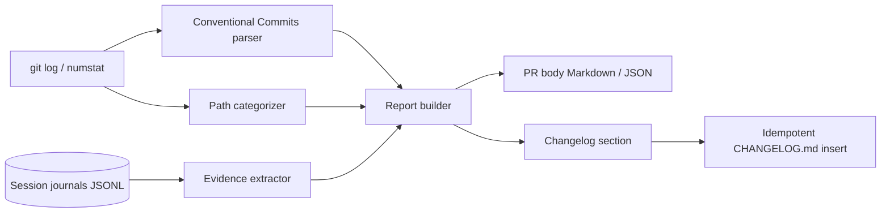

# mergescribe

[English](README.md) | [中文](README.zh.md) | [日本語](README.ja.md)

[](LICENSE) [](CHANGELOG.md) [](pyproject.toml)  [](CONTRIBUTING.md)

**Open-source PR descriptions and changelogs built deterministically from session journals and git history — no LLM, same inputs, same bytes.**


```bash
git clone https://github.com/JaydenCJ/mergescribe && cd mergescribe && pip install -e .
```

> **Pre-release:** mergescribe is not yet published to PyPI. Until the first release, clone [JaydenCJ/mergescribe](https://github.com/JaydenCJ/mergescribe) and run `pip install -e .` from the repository root. The package has zero runtime dependencies, so `PYTHONPATH=src python3 -m mergescribe` works without any install at all.

## Why mergescribe?

Agents now produce code faster than humans write PR bodies, and the fashionable fix is to point another LLM at the diff and ask for a summary — which costs tokens, ships your diff to an API, and can confidently describe changes that are not in the commit. mergescribe takes the opposite bet: everything a good PR description needs already exists as *records* — Conventional Commits, the numstat, and the session journal that logged which tests actually ran and how they exited. So it extracts instead of generating: parse, classify against static tables, render. The output is traceable line-by-line to its inputs, byte-identical on every run, and honest about gaps ("no session journal provided" instead of an invented test plan). For review-fatigued teams, a description that *cannot* hallucinate is worth more than one that reads beautifully.

|  | mergescribe | PR-Agent | Copilot PR summary | git-cliff | conventional-changelog |
|---|---|---|---|---|---|
| Needs an LLM / API key | No | Yes | Yes (hosted) | No | No |
| Deterministic (same input → same bytes) | Yes | No | No | Yes | Yes |
| PR description, not just changelog | Yes | Yes | Yes | No | No |
| Verification table from real exit codes | Yes (session journal) | No | No | No | No |
| Diff can hallucinate in output | Impossible by design | Possible | Possible | n/a | n/a |
| Runtime dependencies | 0 | 20+ | SaaS | Rust binary | 300+ npm tree |

<sub>Dependency counts as of 2026-07: pr-agent 0.3.x declares 20+ runtime requirements on PyPI; conventional-changelog-cli pulls a 300+ package npm tree. mergescribe's count is `dependencies = []` in [pyproject.toml](pyproject.toml).</sub>

## Features

- **Zero hallucination by construction** — every line of output is parsed from a commit, a numstat row, or a journal event; there is no generative step that could invent a change or a test result.
- **Verification evidence, not vibes** — journal commands are classified (test/typecheck/lint/format/build) by a static prefix table, deduped per normalized command, and reported with the **last** exit code — the state the PR actually ships with, including loud `FAIL` rows.
- **Forgiving Conventional Commits parser** — full support for scopes, `!`, footer blocks, `BREAKING CHANGE` notes, and closing vs. plain issue references; hand-written subjects degrade to an honest "Other changes" section instead of being dropped.
- **Changelogs with receipts** — commit types map onto Keep-a-Changelog categories through a documented table, breaking and security changes are never filtered out, and `--insert` splices into your CHANGELOG.md idempotently (run it twice, the file does not change).
- **No wall clock, no network** — release dates come from commit history or an explicit flag; the only process spawned is your local `git`. Two machines with the same repo and journal produce identical bytes.
- **Scripting-friendly** — `pr`, `commits`, and `journal` all speak `--format json` with a stable schema, exit codes are clean (0/1/2), and a `--title-only` mode feeds `gh pr create --title "$(...)"` one-liners.

## Quickstart

Install (or just set `PYTHONPATH=src` from a checkout):

```bash
git clone https://github.com/JaydenCJ/mergescribe && cd mergescribe && pip install -e .
```

Build the bundled demo repository (pinned dates, so your output matches this README exactly) and generate a PR body from its feature branch plus the sample session journal:

```bash
bash examples/build_demo_repo.sh /tmp/demo
mergescribe -C /tmp/demo pr --base main --head feature --journal examples/session-journal.jsonl
```

Real captured output (truncated with `...`):

```text
# feat(api): add cursor pagination to list endpoints (+2 more commits)

## Summary

- Add cursor pagination to list endpoints
- Return 404 instead of 500 for missing cursor
...
## Verification

| Check | Command | Runs | Last result |
|---|---|---|---|
| test | `pytest -q` | 2 | pass (exit 0) |
| typecheck | `mypy src` | 1 | pass (exit 0) |
| lint | `ruff check src` | 1 | pass (exit 0) |

## Session notes

- first run failed: off-by-one in cursor decoding
- decision: kept cursors opaque base64 instead of numeric offsets
...
Closes #42, #57.

_Generated deterministically by mergescribe from 3 commits and 1 session journal — no LLM involved._
```

The changelog section for the same range, dated from the newest commit (never from today's clock):

```bash
mergescribe -C /tmp/demo changelog --base main --head feature --release 0.2.0
```

```text
## [0.2.0] - 2026-07-11

### Added

- **api:** Add cursor pagination to list endpoints (#42)

### Fixed

- **api:** Return 404 instead of 500 for missing cursor (#57)
```

## Session journals

A journal is a JSONL file — one event per line — written by an agent harness, a shell hook, or a human. mergescribe reads liberal key aliases so most harness logs work unmodified; the full format lives in [`docs/journal-format.md`](docs/journal-format.md).

| Event kind | Aliases | Feeds |
|---|---|---|
| `command` | `cmd`, `run`, `shell`, `exec`, `tool` | Verification table (with exit codes) |
| `note` / `decision` | `comment`, `observation`, `log`, `choice` | Session notes |
| `edit` | `write`, `patch`, `file_edit` | reserved (diff cross-check, roadmap) |

Repeated runs of the same command are folded into one row: `runs` counts them, and the **last** exit code wins — a red first run that you fixed reports as `pass (exit 0)`, while a check that was failing when the session ended reports `FAIL` in bold table daylight.

## What lands where

| Commit type | PR section | Changelog category (default) |
|---|---|---|
| `feat` | Features | Added |
| `fix` | Fixes | Fixed (or Security if scope/CVE says so) |
| `perf`, `refactor`, `revert` | Performance / Refactoring / Reverts | Changed |
| `docs`, `test`, `build`, `ci`, `chore`, `style` | own sections | excluded (included with `--all`) |
| anything breaking (`!` or `BREAKING CHANGE`) | Breaking changes section | always included |
| non-conventional subject | Other changes | excluded (included with `--all`) |

## Architecture



## Roadmap

- [x] Commit/journal extraction, PR body + changelog rendering, four subcommands, JSON output, idempotent insert (v0.1.0)
- [ ] `edit`-event cross-check: flag files changed in the diff but never touched in the journal (and vice versa)
- [ ] Native readers for popular agent-harness transcript formats
- [ ] PyPI release with `pip install mergescribe`
- [ ] `mergescribe pr --update` for refreshing an existing PR body in place via a marker block

See the [open issues](https://github.com/JaydenCJ/mergescribe/issues) for the full list.

## Contributing

Contributions are welcome — start with a [good first issue](https://github.com/JaydenCJ/mergescribe/issues?q=is%3Aissue+is%3Aopen+label%3A%22good+first+issue%22) or open a [discussion](https://github.com/JaydenCJ/mergescribe/discussions). See [CONTRIBUTING.md](CONTRIBUTING.md) for the development setup; this repository ships no CI — `pytest` (91 tests) and `bash scripts/smoke.sh` (must print `SMOKE OK`) are the whole verification story, run locally.

## License

[MIT](LICENSE)
