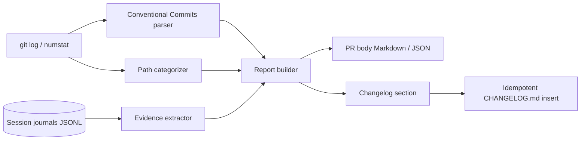

# mergescribe

[English](README.md) | [中文](README.zh.md) | [日本語](README.ja.md)

[](LICENSE) [](CHANGELOG.md) [](pyproject.toml)  [](CONTRIBUTING.md)

**开源工具：从会话日志和 git 历史确定性地生成 PR 描述与 changelog —— 不用 LLM，输入相同，输出逐字节相同。**


```bash
git clone https://github.com/JaydenCJ/mergescribe && cd mergescribe && pip install -e .
```

> **预发布：** mergescribe 尚未发布到 PyPI。首个正式版之前，请克隆 [JaydenCJ/mergescribe](https://github.com/JaydenCJ/mergescribe) 并在仓库根目录执行 `pip install -e .`。软件包零运行时依赖，所以 `PYTHONPATH=src python3 -m mergescribe` 完全不安装也能运行。

## 为什么选 mergescribe？

如今 Agent 写代码的速度已经超过人类写 PR 描述的速度，而流行的解法是再拿一个 LLM 对着 diff 生成摘要——既烧 token，又把 diff 发给外部 API，还可能信誓旦旦地描述提交里根本不存在的改动。mergescribe 押注相反的方向：一份好的 PR 描述所需的一切早已以*记录*的形式存在——Conventional Commits、numstat、以及记录了哪些测试真正跑过和退出码的会话日志。因此它只提取、不生成：解析、按静态表分类、渲染。输出的每一行都能逐行追溯到输入，每次运行逐字节一致，对缺口也保持诚实（写"未提供会话日志"，而不是编造一份测试计划）。对被 review 疲劳折磨的团队而言，一份*不可能*幻觉的描述，比一份写得漂亮的描述值钱得多。

|  | mergescribe | PR-Agent | Copilot PR 摘要 | git-cliff | conventional-changelog |
|---|---|---|---|---|---|
| 需要 LLM / API key | 否 | 是 | 是（托管服务） | 否 | 否 |
| 确定性（相同输入 → 相同字节） | 是 | 否 | 否 | 是 | 是 |
| 生成 PR 描述而不只是 changelog | 是 | 是 | 是 | 否 | 否 |
| 用真实退出码生成验证表 | 是（会话日志） | 否 | 否 | 否 | 否 |
| 输出可能幻觉 diff 内容 | 设计上不可能 | 可能 | 可能 | 不适用 | 不适用 |
| 运行时依赖 | 0 | 20+ | SaaS | Rust 二进制 | 300+ npm 依赖树 |

<sub>依赖数量统计于 2026-07：pr-agent 0.3.x 在 PyPI 上声明 20+ 项运行时依赖；conventional-changelog-cli 会拉下 300+ 个 npm 包。mergescribe 的数字是 [pyproject.toml](pyproject.toml) 里的 `dependencies = []`。</sub>

## 特性

- **从构造上杜绝幻觉** —— 输出的每一行都解析自某个 commit、某行 numstat 或某条日志事件；不存在任何可能凭空发明改动或测试结果的生成步骤。
- **验证靠证据，不靠感觉** —— 日志里的命令按静态前缀表分类（test/typecheck/lint/format/build），按规范化命令去重，并报告**最后一次**退出码——即 PR 实际交付时的状态，失败会以醒目的 `FAIL` 行呈现。
- **宽容的 Conventional Commits 解析器** —— 完整支持 scope、`!`、footer 块、`BREAKING CHANGE` 注记，并区分关闭型与普通 issue 引用；手写的提交主题会降级为诚实的"其他改动"区块，而不是被丢弃。
- **有凭有据的 changelog** —— 提交类型经一张有文档的映射表落入 Keep-a-Changelog 分类，破坏性与安全性改动永不被过滤，`--insert` 幂等地拼接进你的 CHANGELOG.md（跑两遍，文件不变）。
- **不读时钟，不碰网络** —— 发布日期来自提交历史或显式参数；唯一会启动的外部进程是本地 `git`。两台机器上相同的仓库加日志会产出完全相同的字节。
- **对脚本友好** —— `pr`、`commits`、`journal` 都支持 schema 稳定的 `--format json`，退出码干净（0/1/2），还有供 `gh pr create --title "$(...)"` 单行调用的 `--title-only` 模式。

## 快速开始

安装（或直接在检出目录设置 `PYTHONPATH=src`）：

```bash
git clone https://github.com/JaydenCJ/mergescribe && cd mergescribe && pip install -e .
```

构建内置的演示仓库（日期已固定，所以你的输出会和本 README 完全一致），再从它的 feature 分支加示例会话日志生成 PR 描述：

```bash
bash examples/build_demo_repo.sh /tmp/demo
mergescribe -C /tmp/demo pr --base main --head feature --journal examples/session-journal.jsonl
```

真实运行输出（用 `...` 截断）：

```text
# feat(api): add cursor pagination to list endpoints (+2 more commits)

## Summary

- Add cursor pagination to list endpoints
- Return 404 instead of 500 for missing cursor
...
## Verification

| Check | Command | Runs | Last result |
|---|---|---|---|
| test | `pytest -q` | 2 | pass (exit 0) |
| typecheck | `mypy src` | 1 | pass (exit 0) |
| lint | `ruff check src` | 1 | pass (exit 0) |

## Session notes

- first run failed: off-by-one in cursor decoding
- decision: kept cursors opaque base64 instead of numeric offsets
...
Closes #42, #57.

_Generated deterministically by mergescribe from 3 commits and 1 session journal — no LLM involved._
```

同一提交范围的 changelog 区块，日期取自最新提交（绝不取今天的时钟）：

```bash
mergescribe -C /tmp/demo changelog --base main --head feature --release 0.2.0
```

```text
## [0.2.0] - 2026-07-11

### Added

- **api:** Add cursor pagination to list endpoints (#42)

### Fixed

- **api:** Return 404 instead of 500 for missing cursor (#57)
```

## 会话日志

日志是 JSONL 文件——每行一个事件——由 Agent harness、shell hook 或人手写入。mergescribe 接受宽松的键名别名，多数 harness 的日志无需改动即可读取；完整格式见 [`docs/journal-format.md`](docs/journal-format.md)。

| 事件类型 | 别名 | 供给 |
|---|---|---|
| `command` | `cmd`、`run`、`shell`、`exec`、`tool` | 验证表（含退出码） |
| `note` / `decision` | `comment`、`observation`、`log`、`choice` | 会话备注 |
| `edit` | `write`、`patch`、`file_edit` | 预留（diff 交叉核对，见路线图） |

同一命令的多次运行折叠为一行：`runs` 计数，且**最后一次**退出码胜出——先红后修好的测试报告为 `pass (exit 0)`，而会话结束时仍在失败的检查会在表格里明晃晃地写着 `FAIL`。

## 各类提交落在哪里

| 提交类型 | PR 区块 | changelog 分类（默认） |
|---|---|---|
| `feat` | Features | Added |
| `fix` | Fixes | Fixed（scope/CVE 表明时归 Security） |
| `perf`、`refactor`、`revert` | Performance / Refactoring / Reverts | Changed |
| `docs`、`test`、`build`、`ci`、`chore`、`style` | 各自区块 | 默认排除（`--all` 时纳入） |
| 任何破坏性改动（`!` 或 `BREAKING CHANGE`） | Breaking changes 区块 | 永远纳入 |
| 非规范提交主题 | Other changes | 默认排除（`--all` 时纳入） |

## 架构



## 路线图

- [x] 提交/日志提取、PR 描述 + changelog 渲染、四个子命令、JSON 输出、幂等插入（v0.1.0）
- [ ] `edit` 事件交叉核对：标出 diff 里改了但日志从未触碰的文件（以及反向情况）
- [ ] 原生支持主流 Agent harness 的 transcript 格式
- [ ] 发布到 PyPI，支持 `pip install mergescribe`
- [ ] `mergescribe pr --update`：通过标记块原地刷新已有 PR 描述

完整列表见 [open issues](https://github.com/JaydenCJ/mergescribe/issues)。

## 参与贡献

欢迎贡献——可以从 [good first issue](https://github.com/JaydenCJ/mergescribe/issues?q=is%3Aissue+is%3Aopen+label%3A%22good+first+issue%22) 入手，或发起一个 [discussion](https://github.com/JaydenCJ/mergescribe/discussions)。开发环境配置见 [CONTRIBUTING.md](CONTRIBUTING.md)；本仓库不带 CI——本地运行的 `pytest`（91 个测试）与 `bash scripts/smoke.sh`（必须打印 `SMOKE OK`）就是全部的验证流程。

## 许可证

[MIT](LICENSE)
